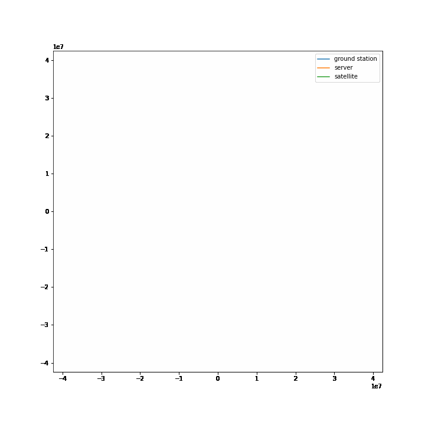

# Servers-above
___
__Servers Above__ is a proof of concept simulation for one of my crazy ideas to put server on orbit.

- [x] Stage 1 - orbit simulation (circular)

    
    
- [ ] Stage 2 - communication simulation
- [ ] Stage 3 - conclusions

## Bibliography:
1. [In-orbit Computing: An Outlandish thought Experiment?](https://dl.acm.org/doi/abs/10.1145/3422604.3425937)